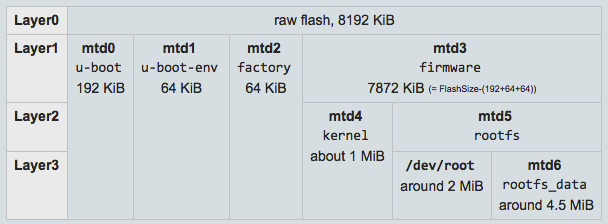

# MediaTek LinkIt Smart 7688 with OpenWrt

## Flash Layout



```
[    0.290000] spi-mt7621 10000b00.spi: sys_freq: 193333333
[    0.300000] m25p80 spi32766.0: w25q128 (16384 Kbytes)
[    0.300000] m25p80 spi32766.0: using chunked io
[    0.310000] 4 ofpart partitions found on MTD device spi32766.0
[    0.310000] Creating 4 MTD partitions on "spi32766.0":
[    0.320000] 0x000000000000-0x000000030000 : "u-boot"
[    0.320000] 0x000000030000-0x000000040000 : "u-boot-env"
[    0.330000] 0x000000040000-0x000000050000 : "factory"
[    0.340000] 0x000000050000-0x000001000000 : "firmware"
[    0.370000] 2 uimage-fw partitions found on MTD device firmware
[    0.380000] 0x000000050000-0x000000169d29 : "kernel"
[    0.390000] 0x000000169d29-0x000001000000 : "rootfs"
[    0.390000] mtd: device 5 (rootfs) set to be root filesystem
[    0.400000] 1 squashfs-split partitions found on MTD device rootfs
[    0.400000] 0x000000560000-0x000001000000 : "rootfs_data"
[    0.420000] ralink_soc_eth 10100000.ethernet eth0: ralink at 0xb0100000, irq 5
```


```
root@Widora:/# cat /proc/mtd
dev:    size   erasesize  name
mtd0: 00030000 00010000 "u-boot"
mtd1: 00010000 00010000 "u-boot-env"
mtd2: 00010000 00010000 "factory"
mtd3: 00fb0000 00010000 "firmware"
mtd4: 00119d29 00010000 "kernel"
mtd5: 00e962d7 00010000 "rootfs"
mtd6: 00aa0000 00010000 "rootfs_data"
```


```
root@Widora:/# mount
rootfs on / type rootfs (rw)
/dev/root on /rom type squashfs (ro,relatime)
proc on /proc type proc (rw,nosuid,nodev,noexec,noatime)
sysfs on /sys type sysfs (rw,nosuid,nodev,noexec,noatime)
tmpfs on /tmp type tmpfs (rw,nosuid,nodev,noatime)
/dev/mtdblock6 on /overlay type jffs2 (rw,noatime)
overlayfs:/overlay on / type overlay (rw,noatime,lowerdir=/,upperdir=/overlay/upper,workdir=/overlay/work)
tmpfs on /dev type tmpfs (rw,nosuid,relatime,size=512k,mode=755)
devpts on /dev/pts type devpts (rw,nosuid,noexec,relatime,mode=600)
debugfs on /sys/kernel/debug type debugfs (rw,noatime)
mountd(pid1036) on /tmp/run/mountd type autofs (rw,relatime,fd=5,pgrp=1033,timeout=60,minproto=5,maxproto=5,indirect)
```

> https://wiki.openwrt.org/doc/techref/flash.layout

## Backup Factory Data

**In Target**

```
-> check mtd partitions
root@Widora:/# cat /proc/mtd
dev:    size   erasesize  name
mtd0: 00030000 00010000 "u-boot"
mtd1: 00010000 00010000 "u-boot-env"
mtd2: 00010000 00010000 "factory"
mtd3: 00fb0000 00010000 "firmware"
mtd4: 00119d29 00010000 "kernel"
mtd5: 00e962d7 00010000 "rootfs"

-> backup factory partition
root@Widora:/# dd if=/dev/mtd2 of=/tmp/factory.backup.bin
128+0 records in
128+0 records out

-> set network (connect board to router/switch with cable)
root@Widora:/# ifconfig br-lan 192.168.31.224
root@Widora:/# ping 192.168.31.1
PING 192.168.31.1 (192.168.31.1): 56 data bytes
64 bytes from 192.168.31.1: seq=0 ttl=64 time=1.009 ms
64 bytes from 192.168.31.1: seq=1 ttl=64 time=0.481 ms
^C
--- 192.168.31.1 ping statistics ---
2 packets transmitted, 2 packets received, 0% packet loss
round-trip min/avg/max = 0.481/0.745/1.009 ms

-> set root password
root@Widora:/# passwd root
Changing password for root
New password:				(-> enter password, can be simple leave as blank)
Bad password: too short
Retype password:
Password for root changed by root
```


**Host Side**

```
$ scp root@192.168.31.xxx:/tmp/factory.backup.bin .
root@192.168.31.224's password: 
factory.backup.bin                     100%   64KB  64.0KB/s   00:00  
$ cp factory.backup.bin /to/safe/storage
```

## Flashing Image

### via `tftp`

1. Setup tftp server (http://askubuntu.com/questions/201505/how-do-i-install-and-run-a-tftp-server)

   >  Ignore if setup already.

2. Make your own image

3. Put image to tftp server folder (`/tftpboot`)

   ```
   $ cp -f bin/ramips/openwrt-ramips-mt7688-LinkIt7688-squashfs-sysupgrade.bin /tftpboot/w0
   ```

   **Suggest to use short file name in tftp server folder for convenient use in `uboot`.**

4. Power on target and enter uboot tftp boot mode

   ```
   Continuing normal boot...

   Please choose the operation:
      1: Load system code to SDRAM via TFTP.
      2: Load system code then write to Flash via TFTP.
      3: Boot system code via Flash (default).
      4: Entr boot command line interface.
      5: Entr ALL LED test mode.
      6: Entr Web failsafe mode.
      7: Load Boot Loader code then write to Flash via Serial.
      9: Load Boot Loader code then write to Flash via TFTP.
   ```

   Select **1** or **2** once you see above output in terminal.

5. Connect target board to router with network cable

6. Setup IP address (both target and tftp server) and image file

   ```
    Please Input new ones /or Ctrl-C to discard
           Input device IP (192.168.31.224) ==:192.168.31.224
           Input server IP (192.168.31.59) ==:192.168.31.59
           Input Linux Kernel filename (w0) ==:w0
   ```

7. Start loading image via tftp and boot

   ```
    netboot_common, argc= 3

    NetTxPacket = 0x87FE6D00

    KSEG1ADDR(NetTxPacket) = 0xA7FE6D00

    NetLoop,call eth_halt !

    NetLoop,call eth_init !
   Trying Eth0 (10/100-M)

    Waitting for RX_DMA_BUSY status Start... done


    ETH_STATE_ACTIVE!!
   TFTP from server 192.168.31.59; our IP address is 192.168.31.224
   Filename 'w0'.

    TIMEOUT_COUNT=10,Load address: 0x80a00000
   Loading: Got ARP REPLY, set server/gtwy eth addr (1c:1b:0d:0a:db:c6)
   Got it
   #################################################################
            #################################################################
            #################################################################
            #################################################################
            #################################################################
            #################################################################
   ```


### via `sysupgrade`

**In Target**

1. Setup target ip address and account

   ```
   -> set network (connect board to router/switch with cable)
   root@Widora:/# ifconfig br-lan 192.168.31.224

   -> check network setting
   root@Widora:/# ping 192.168.31.1
   PING 192.168.31.1 (192.168.31.1): 56 data bytes
   64 bytes from 192.168.31.1: seq=0 ttl=64 time=1.009 ms
   64 bytes from 192.168.31.1: seq=1 ttl=64 time=0.481 ms
   ^C
   --- 192.168.31.1 ping statistics ---
   2 packets transmitted, 2 packets received, 0% packet loss
   round-trip min/avg/max = 0.481/0.745/1.009 ms

   -> set root password
   root@Widora:/# passwd root
   Changing password for root
   New password:				(-> enter password, can be simple leave as blank)
   Bad password: too short
   Retype password:
   Password for root changed by root
   ```

2. Copy image to target

   **using `scp`**

   ```
   $ scp bin/ramips/openwrt-ramips-mt7688-LinkIt7688-squashfs-sysupgrade.bin root@192.168.31.224:/tmp/ow-upgrade.bin
   root@192.168.31.224's password: 
   openwrt-ramips-mt7688-LinkIt7688-squashfs-sysupgrade.bin                            100%   14MB   2.3MB/s   00:06    
   ```

   **using `nc`**

   ```
   # on linux pc
   $ cat bin/ramips/openwrt-ramips-mt7688-LinkIt7688-squashfs-sysupgrade.bin | pv -b | nc -l -p 12345

   # on target
   $ nc 192.168.1.111 12345 > /tmp/ow-upgrade.bin
   ```

   NOTE:

   - Port 12345 and IP address 192.168.1.111 are just examples.
   - The command `pv -b` is optional for tracking progress but maybe you have to install `pv` to your system previously.

3. Write image to flash

   ```
   root@mylinkit:/# sysupgrade -v /tmp/ow-upgrade.bin
   Saving config files...
   etc/avahi/avahi-daemon.conf
   etc/avrdude.conf
   ...
   etc/udev/udev.conf
   killall: watchdog: no process killed
   Sending TERM to remaining processes ... uhttpd smbd nmbd avahi-daemon mountd ntpd dnsmasq ubusd logd rpcd netifd odhcpd
   Sending KILL to remaining processes ...
   Switching to ramdisk...
   Performing system upgrade...
   Unlocking firmware ...

   Writing from <stdin> to firmware ...  [w]
   Appending jffs2 data from /tmp/sysupgrade.tgz to firmwar
   Upgrade completed
   Rebooting system...
   [ 2186.460000] reboot: Restarting system

   ```

4. Target will automatically reboot after flashing done

### via `mtd`

Same steps as `sysupgraade` except:

```
$ mtd -r write /tmp/ow-upgrade.bin firmware
```

> https://wiki.openwrt.org/doc/howto/generic.sysupgrade

### Using SDK

#### Build

```
$ tar jxvf OpenWrt-SDK-ramips-mt7688_gcc-4.8-linaro_uClibc-0.9.33.2.Linux-x86_64.tar.bz2
$ cd OpenWrt-SDK-ramips-mt7688_gcc-4.8-linaro_uClibc-0.9.33.2.Linux-x86_64
$ git clone git@git.muabaobao.com:depot/mua-ow-hello.git package/mua-ow-hello
$ make package/mua-ow-hello/{download,prepare,compile}

# check result
$ ls build_dir/target-mipsel_24kec+dsp_uClibc-0.9.33.2/
function_key  function_key.c  function_key.o  ipkg-ramips_24kec  Makefile
$ ls bin/ramips/packages/base
function_key_1.0-1_ramips_24kec.ipk
```

#### Run and Debug

**Push execute program to target**

```
$ scp build_dir/target-mipsel_24kec+dsp_uClibc-0.9.33.2/function_key root@192.168.31.224:/usr/local/bin
```

**Run on target**

```
root@mylinkit:/# 
root@mylinkit:/# /usr/local/bin/function_key 
MRAA Version: v0.8.0
Starting Read on IO6
Gpio is 0
Gpio is 0
Gpio is 0
```

#### Using ipk

**Push ipk to target**

```
$ scp bin/ramips/packages/base/function_key_1.0-1_ramips_24kec.ipk root@192.168.31.224:/tmp/
```

**Install ipk and run**

```
root@mylinkit:/# opkg install tmp/function_key_1.0-1_ramips_24kec.ipk 
Installing function_key (1.0-1) to root...
Configuring function_key.
root@mylinkit:/# 
root@mylinkit:/# 
root@mylinkit:/# 
root@mylinkit:/# function_key 
root@mylinkit:/# ls /usr/bin/function_key 
/usr/bin/function_key
root@mylinkit:/# /usr/bin/function_key 
MRAA Version: v0.8.0
Starting Read on IO6
Gpio is 1
Gpio is 1
Gpio is 1
Gpio is 1

```


> https://wiki.openwrt.org/doc/howto/obtain.firmware.sdk

