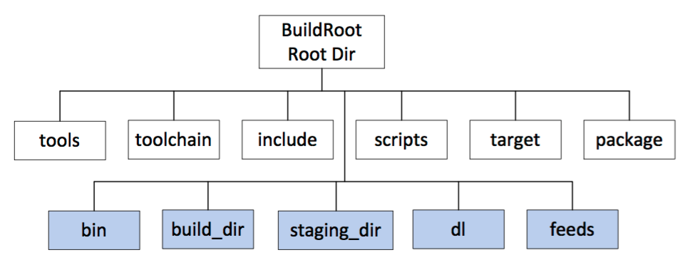
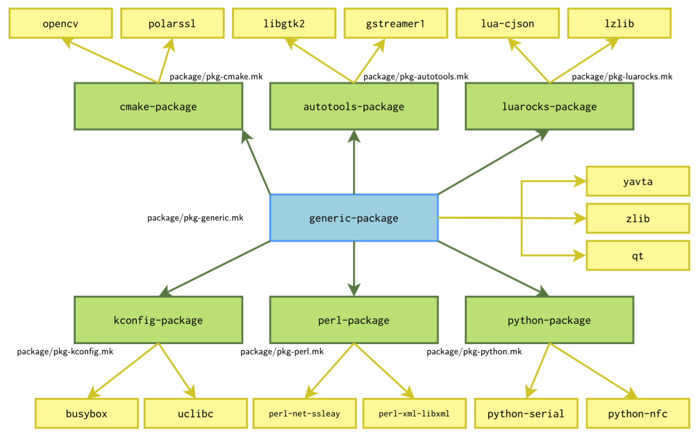
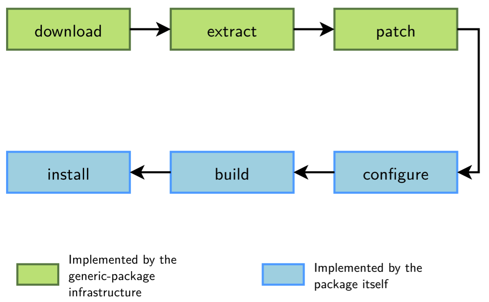
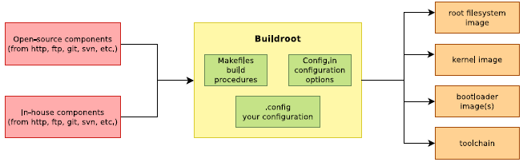
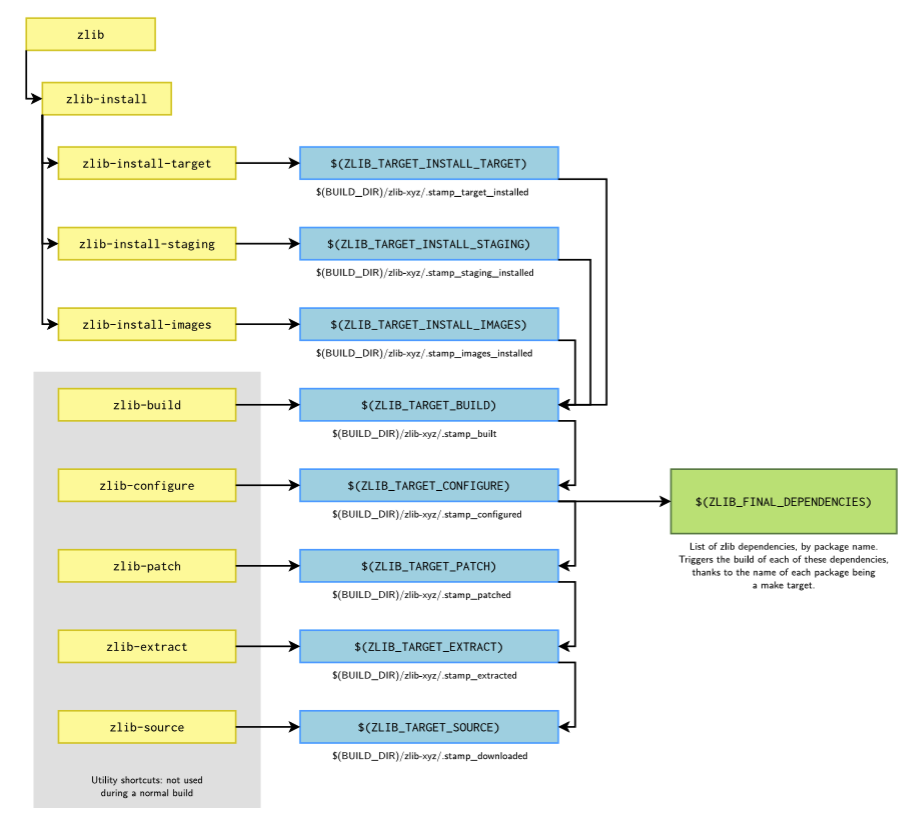
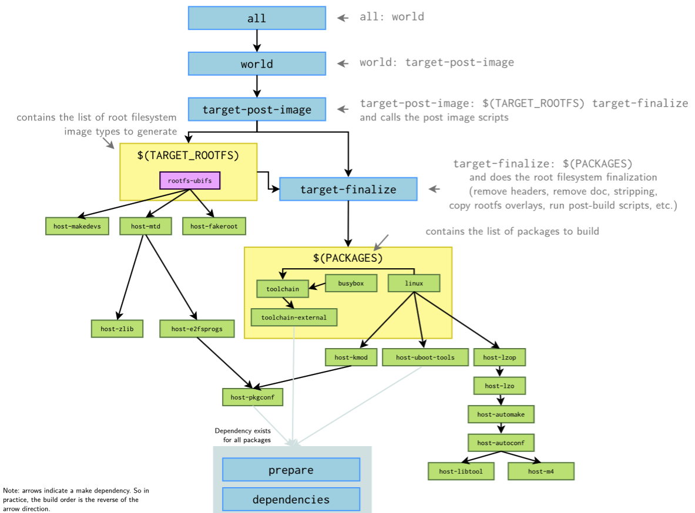

# Learning OpenWrt

## What's OpenWrt

OpenWrt is a highly extensible GNU/Linux distribution for embedded devices (typically wireless routers).
Unlike many other distributions for these routers, OpenWrt is built from the ground up to be a full-featured,
easily modifiable operating system for your router.

Instead of trying to create a single, static firmware, OpenWrt provides a fully writable filesystem with
optional package management. This frees you from the restrictions of the application selection and
configuration provided by the vendor and allows you to use packages to customize an embedded device
to suit any application. For developers, OpenWrt provides a framework to build an application without
having to create a complete firmware image and distribution around it. For users, this means the freedom
of full customization, allowing the use of an embedded device in ways the vendor never envisioned.

OpenWrt is not intended to be a distribution you can load onto an embedded device and expect to do
everything you want out of the box. Instead, the OpenWrt framework allows you to tailor your embedded
operating system to your own particular needs. At the very least, you should add features you require
to the bare OpenWrt installation by installing software packages, such as a graphical web interface that
provides easy access for beginners.

OpenWrt's objectives:
- OpenWrt will never be a product, but something which makes it easy to build a product.
- OpenWrt will never be finished, never be complete, but will always be tracking the progress of technology.
- OpenWrt will never be specific, it will always remain generic.
- OpenWrt will never be the cathedral, it will simply supply the building blocks to construct one.

> https://wiki.openwrt.org/about/start

## Download

## Branch

Code Name           | Translation | Version    | Status
------------------- | ----------- | ---------- | --------------
Designated Driver   | 代驾人      | developing | trunk
Chaos Calmer        | 平乱人      | 15.05.1    | current stable
Chaos Calmer        |             | 15.05      |
Barrier Breaker     | 破障人      | 14.07      |
Attitude Adjustment | 态度调整    | 12.09      |

> https://wiki.openwrt.org/about/history
>
> https://en.wikipedia.org/wiki/OpenWrt#History

## Build

### Quick Start

```
$ ./scripts/feeds update -a
$ ./scripts/feeds install -a
$ make menuconfig           # config target options for most cases
$ make [-jN] [V=scw]        # -jN optional, N is the number of cpu cores, V=s/c/w for warning, errors and tracing

The parameter V=x specifies level of messages in the process of the build.
    V=99 and V=1 are now deprecated in favor of a new verbosity class system,
    though the old flags are still supported.
    You can set the V variable on the command line (or OPENWRT_VERBOSE in the
    environment) to one or more of the following characters:

    - s: stdout+stderr (equal to the old V=99)
    - c: commands (for build systems that suppress commands by default, e.g. kbuild, cmake)
    - w: warnings/errors only (equal to the old V=1)
```

The OpenWrt build system is a set of Makefiles and patches that allows users to easily
generate both a cross-compilation toolchain and a root filesystem for embedded systems.

### Build System Features
- Makes it easy to port software
- Uses kconfig (Linux Kernel menuconfig) for configuration of features
- Provides integrated cross-compiler toolchain (gcc, ld, ...)
- Provides abstraction for autotools (automake, autoconf), cmake, scons
- Handles standard download, patch, configure, compile and packaging workflow
- Provides a number of common fixups for badly behaving packages

### Make Targets
- Offers a number of high level make targets for standard package workflows
- Targets always in the format "component/name/action", e.g. "toolchain/gdb/compile" or "package/mtd/install"
- Prepare a package source tree: package/foo/prepare
- Compile a package: package/foo/compile
- Clean a package: package/foo/clean

```
  make[2] toolchain/install
  make[3] -C toolchain install
  make[2] target/compile
  make[3] -C target compile
  make[4] -C target/utils prepare
```

> https://wiki.openwrt.org/about/toolchain

### Build Sequence
```
tools - automake, autoconf, sed, cmake
toolchain/binutils - as, ld, ...
toolchain/gcc - gcc, g++, cpp, ...
target/linux - kernel modules
package - core and feed packages
target/linux - kernel image
target/linux/image - firmware image file generation
```

### Make Sequence

Top command make world calls the following sequence of the commands:
```
make target/compile
make package/cleanup
make package/compile
make package/install
make package/preconfig
make target/install
make package/index
```

You may run each command independency. For example, if the process of compilation of packages stops on error, you may fix the problem and next continue without cleanup:
```
make package/compile
make package/install
make package/preconfig
make target/install
make package/index
```

> https://wiki.openwrt.org/doc/techref/buildroot

### Notes About Buildroot / SDK

The OpenWrt project provides **two** main ways to get your software compiled for and running on an OpenWrt device.
- The first option is to download and build the complete toolchain (buildroot)
- The second is to download and/or build the SDK, a stripped down version of the toolchain intended to only build packages, and not firmware images.

> https://github.com/MagnusS/p2p-dprd/wiki/BuildingOpenWrtPackages

> https://forum.openwrt.org/viewtopic.php?pid=31794#p31794

### Usage Example

#### Updating Feeds

```
./scripts/feeds update -a
./scripts/feeds install -a
./scripts/feeds install <PACKAGENAME>
```

#### Config

```
make menuconfig
-or-
make defconfig
```

```
./scripts/diffconfig.sh > diffconfig    # write the changes to diffconfig
cp diffconfig .config                   # write changes to .config
make defconfig                          # expand to full config
```

```
make kernel_menuconfig CONFIG_TARGET=subtarget  # -> kernel config, optional
```

#### Build Images

```
make
-or-
make world
```

#### Clean Up

**Clean**
```
make clean
```

deletes contents of the directories `/bin` and `/build_dir`. `make clean` does not remove the `toolchain`, it also avoids cleaning architectures/targets other than the one you have selected in your `.config`.

**Dirclean**
```
make dirclean
```

deletes contents of the directories `/bin` and `/build_dir` and additionally `/staging_dir` and `/toolchain` (=the cross-compile tools) and `/logs`. 'dirclean' is your basic "full clean" operation.

**Distclean**
```
make distclean
```

nukes everything you have compiled or configured and also deletes all downloaded feeds contents and package sources.

CAUTION: In addition to all else, this will erase your build configuration (<buildroot_dir>/.config), your toolchain and all other sources. Use with care!

**Clean Small Part**

```
make target/linux/clean
make package/base-files/clean
make package/luci/clean
```

#### Make Tips

**Building Single Packages**

```
make package/cups/compile V=s
make package/cups/{clean,compile,install} V=s   # for a rebuild
```

**Spotting Build Errors**

```
make V=s 2>&1 | tee build.log | grep -i error
```

**Getting Beep Notification**

```
make V=s ; echo -e '\a'
```

**Skipping Failed Packages**

```
IGNORE_ERRORS=1 make <make options>
```


> https://wiki.openwrt.org/doc/howto/build

> https://forum.openwrt.org/viewtopic.php?id=28267

## Buildroot


### Overview



> The folders in the second lines are generated during compilation.

- **tools** - contains all the build instructions to fetch the image building tools
- **toolchain** - contains all the build instructions to fetch the kernel headers, the C library, the bin-utils, the compiler itself and the debugger. If you add a completely new architecture, you would add a configuration for the C library here.
- **target** - build instruction for firmware image generating process and for the kernel building process; compiles kernel and firmware image utilities, builds firmware image, generate Image Generator (former called Image Builder)
- **package** -  the OpenWrt Makefiles and patches for all the main packages. The OpenWrt Makefile has its own syntax, different from the conventional Makefile of Linux make tool. The OpenWrt Make file defines the meta information of the package, where to download the package, how to compile, where to installed the compiled binaries, etc. See How to Build OpenWrt Application Package for more detail.
- **include** -
- **scripts** -  perl scripts that does the OpenWrt package management
- **dl** - Where the user-space package tarballs will be downloaded
- **build_dir** - where all user-space tools will be cross-compiled
- **staging_dir** -  where the cross-compilation tools will be installed
- **feeds** -
- **bin** -  where the firmware image will be generated and all the .ipk package files will be generated


Simply speaking, once the OpenWrt buildroot has been properly configured, e.g. 
the target platform and architecture is specified, user-space packages selected, etc., the OpenWrt
Buildroot will do the image building through the following steps (once the configuration is done):
1. Download the cross-compilation tools, kernel headers, etc. and
2. Set up the staging directory (staging_dir /). This is where the cross-compilation toolchain will be installed. If you want to use the same cross-compilation toolchain for other purposes, such as compiling third-party applications, you can find the cross-compiler tools in this directory, and then use arch-linux-gcc to compile your application.
3. Create the download directory (dl/ by default). This is where the tarballs will be downloaded.
4. Create the build directory (build_dir/). This is where all user-space tools while be compiled.
5. Create the target directory (build_dir/target-arch/root by default) and the target filesystem skeleton. This directory will contain the final root filesystem.
6. Install the user-space packages to the root file system and compress the whole root file system with proper format. The result firmware image is generated in bin/

> http://www.ccs.neu.edu/home/noubir/Courses/CS6710/S12/material/OpenWrt_Dev_Tutorial.pdf

### How Buildroot Works

Buildroot is basically a set of Makefiles that **download**, **configure**, and **compile** software with the correct options. It also includes patches for various software packages.

Each directory contains at least 2 files:
- something.mk is the Makefile that downloads, configures, compiles and installs the package something.
- Config.in is a part of the configuration tool description file. It describes the options related to the package.

The main Makefile performs the following steps (once the configuration is done):
- Create all the output directories: staging, target, build, etc. in the output directory (output/ by default, another value can be specified using O=)
- Generate the toolchain target.When an internal toolchain is used, this means generating the cross-compilation toolchain. When an external toolchain is used, this means checking the features of the external toolchain and importing it into the Buildroot environment.
- Generate all the targets listed in the TARGETS variable. This variable is filled by all the individual components' Makefiles. Generating these targets will trigger the compilation of the userspace packages (libraries, programs), the kernel, the bootloader and the generation of the root filesystem images, depending on the configuration.

> https://buildroot.org/downloads/manual/manual.html

### Package Infrastructures



- Each software component to be built by Buildroot comes with its own build system.
- Buildroot does not re-invent the build system of each component, it simply uses it.
- Numerous build systems available: hand-written Makefiles or shell scripts, autotools, CMake and also some specific to languages: Python, Perl, Lua, Erlang, etc.
- In order to avoid duplicating code, Buildroot has package infrastructures for well-known build systems.
- And a generic package infrastructure for software components with non-standard build systems.



- To be used for software components having non-standard build systems.
- Implements a default behavior for the downloading, extracting and patching steps of the package build process.
- Implements init script installation, legal information collection, etc.
- Leaves to the package developer the responsibility of describing what should be done for the configuration, building and installation steps.

### Principle



### Package Build Example

```
>>> zlib 1.2.8 Downloading
... here it wgets the tarball ...
>>> zlib 1.2.8 Extracting
xzcat /home/thomas/dl/zlib-1.2.8.tar.xz | tar ...
>>> zlib 1.2.8 Patching
>>> zlib 1.2.8 Configuring
(cd /home/thomas/projets/buildroot/output/build/zlib-1.2.8;
	...
	./configure --shared --prefix=/usr)
>>> zlib 1.2.8 Building
/usr/bin/make -j1 -C /home/thomas/projets/buildroot/output/build/zlib-1.2.8
>>> zlib 1.2.8 Installing to staging directory
/usr/bin/make -j1 -C /home/thomas/projets/buildroot/output/build/zlib-1.2.8
	DESTDIR=/home/thomas/projets/buildroot/output/host/usr/arm-buildroot-linux-uclibcgnueabi/sysroot
	LDCONFIG=true install
>>> zlib 1.2.8 Installing to target
/usr/bin/make -j1 -C /home/thomas/projets/buildroot/output/build/zlib-1.2.8
	DESTDIR=/home/thomas/projets/buildroot/output/target
	LDCONFIG=true install
```



### When You Run Make...



> http://free-electrons.com/doc/training/buildroot/buildroot-slides.pdf

## Concept

## Source Analysis

### feeds

### scripts

### dl

```
dl/1.0.4.3.arm
dl/alsa-lib-1.0.28.tar.bz2
dl/alsa-utils-1.0.28.tar.bz2
dl/autoconf-2.69.tar.xz
dl/automake-1.15.tar.xz
dl/avahi-0.6.31.tar.gz
dl/bc-1.06.95.tar.bz2
dl/binutils-linaro-2.24.0-2014.09.tar.xz
dl/bison-3.0.2.tar.xz
dl/busybox-1.23.2.tar.bz2
dl/cambozola-0.936.tar.gz
dl/cmake-2.8.12.2.tar.gz
dl/dbus-1.9.14.tar.gz
dl/dnsmasq-2.73.tar.xz
dl/dropbear-2015.67.tar.bz2
dl/e2fsprogs-1.42.8.tar.gz
dl/exfat-nofuse-git-20150301.tar.bz2
dl/expat-2.1.0.tar.gz
dl/findutils-4.4.2.tar.gz
dl/firewall-2015-07-27-980b7859bbd1db1e5e46422fccccbce38f9809ab.tar.gz
dl/flex-2.5.39.tar.bz2
dl/fstools-2016-01-10-96415afecef35766332067f4205ef3b2c7561d21.tar.gz
dl/gcc-linaro-4.8-2014.04.tar.xz
dl/gdb-linaro-7.6-2013.05.tar.bz2
dl/gdbm-1.11.tar.gz
dl/gengetopt-2.22.6.tar.gz
dl/gmp-5.1.3.tar.xz
dl/hostapd-2015-03-25.tar.bz2
dl/intltool-0.40.6.tar.bz2
dl/iptables-1.4.21.tar.bz2
dl/jpegsrc.v9a.tar.gz
dl/json-c-0.12.tar.gz
dl/jsonfilter-2014-06-19-cdc760c58077f44fc40adbbe41e1556a67c1b9a9.tar.gz
dl/libdaemon-0.14.tar.gz
dl/libelf-0.8.13.tar.gz
dl/libid3tag-0.15.1b.tar.gz
dl/libiwinfo-2015-06-01-ade8b1b299cbd5748db1acf80dd3e9f567938371.tar.gz
dl/libmad-0.15.1b.tar.gz
dl/libpcap-1.5.3.tar.gz
dl/libtool-2.4.tar.gz
dl/libubox-2015-11-08-10429bccd0dc5d204635e110a7a8fae7b80d16cb.tar.gz
dl/linux-3.18.29.tar.xz
dl/linux-atm-2.5.2.tar.gz
dl/lua-5.1.5.tar.gz
dl/lzma-4.65.tar.bz2
dl/lzo-2.08.tar.gz
dl/m4-1.4.17.tar.xz
dl/madplay-0.15.2b.tar.gz
dl/make-ext4fs-2015-05-01.tar.gz
dl/mbedtls-1.3.14-gpl.tgz
dl/mjpg-streamer-r182.1.tar.bz2
dl/mklibs_0.1.35.tar.gz
dl/mm-common-0.9.7.tar.xz
dl/mountd-2015-11-22-8476a03b25d457e99f59e6372b8d9faebe2266f8.tar.gz
dl/mpc-1.0.2.tar.gz
dl/mpfr-3.1.2.tar.bz2
dl/mtd-utils-1.5.1-92686f212c9a4e16891c6a3c57629cbf4f0f8360.tar.gz
dl/mtk-sdk-wifi-2015-06-01-ade8b1b299cbd5748db1acf80dd3e9f567938371.tar.gz
dl/ncurses-5.9.tar.gz
dl/netifd-2015-12-16-245527193e90906451be35c2b8e972b8712ea6ab.tar.gz
dl/odhcp6c-2015-07-29.tar.bz2
dl/odhcpd-2015-11-19.tar.bz2
dl/openssl-1.0.2h.tar.gz
dl/opkg-9c97d5ecd795709c8584e972bfdf3aee3a5b846d.tar.gz
dl/patch-2.7.5.tar.xz
dl/patchelf-0.8.tar.bz2
dl/pkg-config-0.29.tar.gz
dl/ppp-2.4.7.tar.gz
dl/procd-2015-10-29.1-d5fddd91b966424bb63e943e789704d52382cc18.tar.gz
dl/quilt-0.63.tar.gz
dl/rpcd-2016-04-13-73aea9b8b621a1ce034bc6ee00c9d058a40c8a3d.tar.gz
dl/rtl8712u.bin
dl/scons-2.3.1.tar.gz
dl/sed-4.2.2.tar.bz2
dl/spi-tools-1-cc6a41fdcec60610703ba6db488c621c64952898.tar.gz
dl/squashfs4.2.tar.gz
dl/u-boot-2014.10.tar.bz2
dl/ubox-2015-11-22-c086167a0154745c677f8730a336ea9cf7d71031.tar.gz
dl/ubus-2015-05-25-f361bfa5fcb2daadf3b160583ce665024f8d108e.tar.gz
dl/uci-2015-08-27.1.tar.gz
dl/uClibc-0.9.33.2.tar.bz2
dl/uhttpd-2015-11-08-fe01ef3f52adae9da38ef47926cd50974af5d6b7.tar.gz
dl/usign-2015-05-08-cf8dcdb8a4e874c77f3e9a8e9b643e8c17b19131.tar.gz
dl/ustream-ssl-2015-07-09-c2d73c22618e8ee444e8d346695eca908ecb72d3.tar.gz
dl/util-linux-2.25.2.tar.xz
dl/wireless_tools.29.tar.gz
dl/xz-5.2.1.tar.bz2
dl/yaffs2_android-2008-12-18.tar.bz2
dl/zlib-1.2.8.tar.gz
```

### toolchain

### tools

```
tools/autoconf
tools/automake
tools/b43-tools
tools/bc
tools/bison
tools/ccache
tools/cloog
tools/cmake
tools/dosfstools
tools/e2fsprogs
tools/elftosb
tools/findutils
tools/firmware-utils
tools/flex
tools/flock
tools/gengetopt
tools/gmp
tools/include
tools/libelf
tools/libtool
tools/lzma
tools/lzma-old
tools/m4
tools/make-ext4fs
tools/Makefile
tools/missing-macros
tools/mkimage
tools/mklibs
tools/mm-macros
tools/mpc
tools/mpfr
tools/mtd-utils
tools/mtools
tools/padjffs2
tools/patch
tools/patchelf
tools/patch-image
tools/pkg-config
tools/ppl
tools/qemu
tools/quilt
tools/scons
tools/sed
tools/sparse
tools/squashfs
tools/squashfs4
tools/sstrip
tools/upslug2
tools/upx
tools/wrt350nv2-builder
tools/xz
tools/yaffs2
```

### build_dir

```

build_dir
build_dir/target-mipsel_24kec+dsp_uClibc-0.9.33.2
build_dir/target-mipsel_24kec+dsp_uClibc-0.9.33.2/json-c-0.12
build_dir/target-mipsel_24kec+dsp_uClibc-0.9.33.2/alsa-lib-1.0.28
build_dir/target-mipsel_24kec+dsp_uClibc-0.9.33.2/expat-2.1.0
build_dir/target-mipsel_24kec+dsp_uClibc-0.9.33.2/alsa-utils-1.0.28
build_dir/target-mipsel_24kec+dsp_uClibc-0.9.33.2/libiwinfo-2015-06-01
build_dir/target-mipsel_24kec+dsp_uClibc-0.9.33.2/ubox-2015-11-22
build_dir/target-mipsel_24kec+dsp_uClibc-0.9.33.2/util-linux-2.25.2
build_dir/target-mipsel_24kec+dsp_uClibc-0.9.33.2/libtool-2.4
build_dir/target-mipsel_24kec+dsp_uClibc-0.9.33.2/ppp-default
build_dir/target-mipsel_24kec+dsp_uClibc-0.9.33.2/libdaemon-0.14
build_dir/target-mipsel_24kec+dsp_uClibc-0.9.33.2/ocf-crypto-headers
build_dir/target-mipsel_24kec+dsp_uClibc-0.9.33.2/libnl-tiny-0.1
build_dir/target-mipsel_24kec+dsp_uClibc-0.9.33.2/libid3tag-0.15.1b
build_dir/target-mipsel_24kec+dsp_uClibc-0.9.33.2/gdbm-1.11
build_dir/target-mipsel_24kec+dsp_uClibc-0.9.33.2/zlib-1.2.8
build_dir/target-mipsel_24kec+dsp_uClibc-0.9.33.2/mbedtls-1.3.14
build_dir/target-mipsel_24kec+dsp_uClibc-0.9.33.2/mjpg-streamer-r182
build_dir/target-mipsel_24kec+dsp_uClibc-0.9.33.2/shairport_mmap
build_dir/target-mipsel_24kec+dsp_uClibc-0.9.33.2/swconfig
build_dir/target-mipsel_24kec+dsp_uClibc-0.9.33.2/libubox-2015-11-08
build_dir/target-mipsel_24kec+dsp_uClibc-0.9.33.2/libpcap-1.5.3
build_dir/target-mipsel_24kec+dsp_uClibc-0.9.33.2/uci-2015-08-27.1
build_dir/target-mipsel_24kec+dsp_uClibc-0.9.33.2/lzo-2.08
build_dir/target-mipsel_24kec+dsp_uClibc-0.9.33.2/opkg-unsigned
build_dir/target-mipsel_24kec+dsp_uClibc-0.9.33.2/spi-tools-1
build_dir/target-mipsel_24kec+dsp_uClibc-0.9.33.2/odhcp6c-2015-07-29
build_dir/target-mipsel_24kec+dsp_uClibc-0.9.33.2/maccalc
build_dir/target-mipsel_24kec+dsp_uClibc-0.9.33.2/lua-5.1.5
build_dir/target-mipsel_24kec+dsp_uClibc-0.9.33.2/openssl-1.0.2h
build_dir/target-mipsel_24kec+dsp_uClibc-0.9.33.2/firewall-2015-07-27
build_dir/target-mipsel_24kec+dsp_uClibc-0.9.33.2/stamp
build_dir/target-mipsel_24kec+dsp_uClibc-0.9.33.2/madplay-alsa
build_dir/target-mipsel_24kec+dsp_uClibc-0.9.33.2/libncurses
build_dir/target-mipsel_24kec+dsp_uClibc-0.9.33.2/hostapd-wpad-mini
build_dir/target-mipsel_24kec+dsp_uClibc-0.9.33.2/busybox-1.23.2
build_dir/target-mipsel_24kec+dsp_uClibc-0.9.33.2/uhttpd-2015-11-08
build_dir/target-mipsel_24kec+dsp_uClibc-0.9.33.2/root-ramips
build_dir/target-mipsel_24kec+dsp_uClibc-0.9.33.2/dropbear-2015.67
build_dir/target-mipsel_24kec+dsp_uClibc-0.9.33.2/rpcd
build_dir/target-mipsel_24kec+dsp_uClibc-0.9.33.2/netifd-2015-12-16
build_dir/target-mipsel_24kec+dsp_uClibc-0.9.33.2/linux-ramips_mt7688
build_dir/target-mipsel_24kec+dsp_uClibc-0.9.33.2/mountd-2015-11-22
build_dir/target-mipsel_24kec+dsp_uClibc-0.9.33.2/usign-2015-05-08
build_dir/target-mipsel_24kec+dsp_uClibc-0.9.33.2/odhcpd-2015-11-19
build_dir/target-mipsel_24kec+dsp_uClibc-0.9.33.2/cgi-io
build_dir/target-mipsel_24kec+dsp_uClibc-0.9.33.2/ustream-ssl-polarssl
build_dir/target-mipsel_24kec+dsp_uClibc-0.9.33.2/avahi
build_dir/target-mipsel_24kec+dsp_uClibc-0.9.33.2/toolchain
build_dir/target-mipsel_24kec+dsp_uClibc-0.9.33.2/fstools-2016-01-10
build_dir/target-mipsel_24kec+dsp_uClibc-0.9.33.2/libmad-0.15.1b
build_dir/target-mipsel_24kec+dsp_uClibc-0.9.33.2/u-boot-2014.10
build_dir/target-mipsel_24kec+dsp_uClibc-0.9.33.2/jsonfilter-2014-06-19
build_dir/target-mipsel_24kec+dsp_uClibc-0.9.33.2/dbus-1.9.14
build_dir/target-mipsel_24kec+dsp_uClibc-0.9.33.2/jpeg-9a
build_dir/target-mipsel_24kec+dsp_uClibc-0.9.33.2/ubus-2015-05-25
build_dir/target-mipsel_24kec+dsp_uClibc-0.9.33.2/wireless_tools.29
build_dir/target-mipsel_24kec+dsp_uClibc-0.9.33.2/procd-2015-10-29.1
build_dir/target-mipsel_24kec+dsp_uClibc-0.9.33.2/dnsmasq-nodhcpv6
build_dir/target-mipsel_24kec+dsp_uClibc-0.9.33.2/reg
build_dir/toolchain-mipsel_24kec+dsp_gcc-4.8-linaro_uClibc-0.9.33.2
build_dir/toolchain-mipsel_24kec+dsp_gcc-4.8-linaro_uClibc-0.9.33.2/gcc-linaro-4.8-2014.04
build_dir/toolchain-mipsel_24kec+dsp_gcc-4.8-linaro_uClibc-0.9.33.2/linux-3.18.29
build_dir/toolchain-mipsel_24kec+dsp_gcc-4.8-linaro_uClibc-0.9.33.2/uClibc-dev
build_dir/toolchain-mipsel_24kec+dsp_gcc-4.8-linaro_uClibc-0.9.33.2/gcc-linaro-4.8-2014.04-minimal
build_dir/toolchain-mipsel_24kec+dsp_gcc-4.8-linaro_uClibc-0.9.33.2/gcc-linaro-4.8-2014.04-final
build_dir/toolchain-mipsel_24kec+dsp_gcc-4.8-linaro_uClibc-0.9.33.2/linux-dev
build_dir/toolchain-mipsel_24kec+dsp_gcc-4.8-linaro_uClibc-0.9.33.2/uClibc-0.9.33.2
build_dir/toolchain-mipsel_24kec+dsp_gcc-4.8-linaro_uClibc-0.9.33.2/gdb-linaro-7.6-2013.05
build_dir/toolchain-mipsel_24kec+dsp_gcc-4.8-linaro_uClibc-0.9.33.2/gcc-linaro-4.8-2014.04-initial
build_dir/toolchain-mipsel_24kec+dsp_gcc-4.8-linaro_uClibc-0.9.33.2/binutils-linaro-2.24.0-2014.09
build_dir/host
build_dir/host/autoconf-2.69
build_dir/host/gmp-5.1.3
build_dir/host/padjffs2-1
build_dir/host/bison-3.0.2
build_dir/host/make-ext4fs-2015-05-01
build_dir/host/mklibs-0.1.35
build_dir/host/intltool-0.40.6
build_dir/host/sstrip
build_dir/host/flex-2.5.39
build_dir/host/gengetopt-2.22.6
build_dir/host/libtool-2.4
build_dir/host/patchelf-0.8
build_dir/host/m4-1.4.17
build_dir/host/libelf-0.8.13
build_dir/host/xz-5.2.1
build_dir/host/patch-2.7.5
build_dir/host/flock
build_dir/host/findutils-4.4.2
build_dir/host/cmake-2.8.12.2
build_dir/host/mtd-utils-1.5.1
build_dir/host/mpc-1.0.2
build_dir/host/quilt-0.63
build_dir/host/stamp
build_dir/host/mm-common-0.9.7
build_dir/host/sed-4.2.2
build_dir/host/scons-2.3.1
build_dir/host/pkg-config-0.29
build_dir/host/missing-macros-10
build_dir/host/usign-2015-05-08
build_dir/host/automake-1.15
build_dir/host/patch-image
build_dir/host/lzma-4.65
build_dir/host/ncurses-5.9
build_dir/host/u-boot-2014.10
build_dir/host/squashfs4.2
build_dir/host/firmware-utils
build_dir/host/bc-1.06.95
build_dir/host/e2fsprogs-1.42.8
build_dir/host/mpfr-3.1.2
build_dir/host/yaffs2_android
build_dir/host/opkg-9c97d5ecd795709c8584e972bfdf3aee3a5b846d
```

### config
### package

```
package
package/system
package/system/procd
package/system/opkg
package/system/ubus
package/system/ubox
package/system/mtd
package/system/usign
package/system/ca-certificates
package/system/zram-swap
package/system/udev
package/system/rpcd
package/system/uci
package/system/mountd
package/system/fstools
package/libs
package/libs/argp-standalone
package/libs/libnetfilter-log
package/libs/gmp
package/libs/libusb-compat
package/libs/cyassl
package/libs/gettext-full
package/libs/polarssl
package/libs/ncurses
package/libs/libpcap
package/libs/libnetfilter-conntrack
package/libs/ocf-crypto-headers
package/libs/libevent2
package/libs/libiconv
package/libs/libbsd
package/libs/libjson-c
package/libs/librpc
package/libs/popt
package/libs/lzo
package/libs/libnetfilter-cttimeout
package/libs/gettext
package/libs/libnl
package/libs/uclient
package/libs/libiconv-full
package/libs/libconfig
package/libs/libnetfilter-cthelper
package/libs/libmnl
package/libs/libnfnetlink
package/libs/nettle
package/libs/uclibc++
package/libs/zlib
package/libs/sysfsutils
package/libs/libubox
package/libs/libnftnl
package/libs/libroxml
package/libs/elfutils
package/libs/libusb
package/libs/libtool
package/libs/libnl-tiny
package/libs/libnetfilter-queue
package/libs/libreadline
package/libs/openssl
package/libs/toolchain
package/libs/ustream-ssl
package/devel
package/devel/oprofile
package/devel/valgrind
package/devel/binutils
package/devel/trace-cmd
package/devel/strace
package/devel/gdb
package/devel/perf
package/feeds
package/feeds/packages
package/feeds/luci
package/feeds/routing
package/feeds/management
package/feeds/telephony
package/base-files
package/base-files/files
package/kernel
package/kernel/button-hotplug
package/kernel/drv_regopt
package/kernel/om-watchdog
package/kernel/i2c-gpio-custom
package/kernel/hostap-driver
package/kernel/spi-gpio-custom
package/kernel/mt76
package/kernel/gpio-button-hotplug
package/kernel/trelay
package/kernel/ar7-atm
package/kernel/linux
package/kernel/mmc_over_gpio
package/kernel/brcm2708-gpu-fw
package/kernel/mwlwifi
package/kernel/w1-gpio-custom
package/kernel/avila-wdt
package/kernel/ep80579-drivers
package/kernel/rtc-rv5c386a
package/kernel/acx-mac80211
package/kernel/wrt55agv2-spidevs
package/kernel/rotary-gpio-custom
package/kernel/lantiq
package/kernel/mac80211
package/kernel/broadcom-wl
package/shairport_mmap
package/shairport_mmap/patches
package/shairport_mmap/files
package/shairport_mmap/source
package/firmware
package/firmware/ixp4xx-microcode
package/firmware/linux-firmware
package/firmware/b43legacy-firmware
package/firmware/am33x-cm3
package/firmware/ath10k-firmware
package/firmware/vsc73x5-ucode
package/utils
package/utils/usbreset
package/utils/spidev_test
package/utils/fbtest
package/utils/px5g-standalone
package/utils/bzip2
package/utils/jsonfilter
package/utils/util-linux
package/utils/xfsprogs
package/utils/lua
package/utils/ugps
package/utils/otrx
package/utils/usbmode
package/utils/mkelfimage
package/utils/nvram
package/utils/busybox
package/utils/usbutils
package/utils/px5g
package/utils/mdadm
package/utils/fuse
package/utils/ubi-utils
package/utils/hostap-utils
package/utils/admswconfig
package/utils/robocfg
package/utils/e2fsprogs
package/network
package/network/config
package/network/ipv6
package/network/utils
package/network/services
package/boot
package/boot/yamonenv
package/boot/grub2
package/boot/apex
package/boot/uboot-kirkwood
package/boot/kexec-tools
package/boot/kobs-ng
package/boot/uboot-lantiq
package/boot/uboot-pxa
package/boot/rbcfg
package/boot/uboot-mxs
package/boot/uboot-oxnas
package/boot/uboot-omap
package/boot/uboot-xburst
package/boot/uboot-imx6
package/boot/uboot-sunxi
package/boot/fconfig
package/boot/uboot-envtools
package/boot/imx-bootlets
package/boot/uboot-ar71xx
package/mtk-sdk-wifi
package/reg
```

## Development

## Tools

## Community

## Misc

### Kernel Build Sequence

**download**

```
mkdir -p /home/robbie/GitHub/widora/dl
/home/robbie/GitHub/widora/scripts/download.pl "/home/robbie/GitHub/widora/dl" "linux-3.18.29.tar.xz" "b25737a0bc98e80d12200de93f239c28" "" "@KERNEL/linux/kernel/v3.x"
--2016-07-07 23:42:35--  ftp://ftp.all.kernel.org/pub/linux/kernel/v3.x/linux-3.18.29.tar.xz
=> '-'
Resolving ftp.all.kernel.org (ftp.all.kernel.org)... 199.204.44.194, 198.145.20.140, 149.20.4.69
Connecting to ftp.all.kernel.org (ftp.all.kernel.org)|199.204.44.194|:21... connected.
Logging in as anonymous ... Logged in!
==> SYST ... done.    ==> PWD ... done.
==> TYPE I ... done.  ==> CWD (1) /pub/linux/kernel/v3.x ... done.
==> SIZE linux-3.18.29.tar.xz ... 81044012
==> PASV ... done.    ==> RETR linux-3.18.29.tar.xz ... done.
Length: 81044012 (77M) (unauthoritative)
```

**extract**

```
xzcat /home/robbie/GitHub/widora/dl/linux-3.18.29.tar.xz | tar -C /home/robbie/GitHub/widora/build_dir/toolchain-mipsel_24kec+dsp_gcc-4.8-linaro_uClibc-0.9.33.2 -xf -
```

**patch**

```
rm -rf /home/robbie/GitHub/widora/build_dir/toolchain-mipsel_24kec+dsp_gcc-4.8-linaro_uClibc-0.9.33.2/linux-3.18.29/patches; mkdir -p /home/robbie/GitHub/widora/build_dir/toolchain-mipsel_24kec+dsp_gcc-4.8-linaro_uClibc-0.9.33.2/linux-3.18.29/patches
cp -fpR "/home/robbie/GitHub/widora/target/linux/generic/files"/. /home/robbie/GitHub/widora/build_dir/toolchain-mipsel_24kec+dsp_gcc-4.8-linaro_uClibc-0.9.33.2/linux-3.18.29/

find /home/robbie/GitHub/widora/build_dir/toolchain-mipsel_24kec+dsp_gcc-4.8-linaro_uClibc-0.9.33.2/linux-3.18.29/ -name \*.rej -or -name \*.orig | xargs -r rm -f

Applying /home/robbie/GitHub/widora/target/linux/generic/patches-3.18/000-keep_initrafs_the_default.patch using plaintext: 
patching file init/do_mounts.c

Applying /home/robbie/GitHub/widora/target/linux/generic/patches-3.18/020-ssb_update.patch using plaintext: 
patching file drivers/ssb/pcihost_wrapper.c
patching file drivers/ssb/driver_pcicore.c
patching file drivers/ssb/main.c

Applying /home/robbie/GitHub/widora/target/linux/generic/patches-3.18/021-ssb_sprom.patch using plaintext: 
patching file include/linux/ssb/ssb.h

...
...

Applying /home/robbie/GitHub/widora/target/linux/generic/patches-3.18/999-seccomp_log.patch using plaintext: 
patching file kernel/seccomp.c
patching file include/uapi/linux/seccomp.h
touch /home/robbie/GitHub/widora/build_dir/toolchain-mipsel_24kec+dsp_gcc-4.8-linaro_uClibc-0.9.33.2/linux-3.18.29/.quilt_used
```

**configure**

```
/home/robbie/GitHub/widora/scripts/kconfig.pl  + /home/robbie/GitHub/widora/target/linux/generic/config-3.18 /home/robbie/GitHub/widora/target/linux/ramips/mt7688/config-3.18 > /home/robbie/GitHub/widora/build_dir/target-mipsel_24kec+dsp_uClibc-0.9.33.2/linux-ramips_mt7688/linux-3.18.29/.config.target
awk '/^(#[[:space:]]+)?CONFIG_KERNEL/{sub("CONFIG_KERNEL_","CONFIG_");print}' /home/robbie/GitHub/widora/.config >> /home/robbie/GitHub/widora/build_dir/target-mipsel_24kec+dsp_uClibc-0.9.33.2/linux-ramips_mt7688/linux-3.18.29/.config.target
echo "# CONFIG_KALLSYMS_EXTRA_PASS is not set" >> /home/robbie/GitHub/widora/build_dir/target-mipsel_24kec+dsp_uClibc-0.9.33.2/linux-ramips_mt7688/linux-3.18.29/.config.target
echo "# CONFIG_KALLSYMS_ALL is not set" >> /home/robbie/GitHub/widora/build_dir/target-mipsel_24kec+dsp_uClibc-0.9.33.2/linux-ramips_mt7688/linux-3.18.29/.config.target
echo "# CONFIG_KALLSYMS_UNCOMPRESSED is not set" >> /home/robbie/GitHub/widora/build_dir/target-mipsel_24kec+dsp_uClibc-0.9.33.2/linux-ramips_mt7688/linux-3.18.29/.config.target
/home/robbie/GitHub/widora/scripts/metadata.pl kconfig /home/robbie/GitHub/widora/tmp/.packageinfo /home/robbie/GitHub/widora/.config 3.18 > /home/robbie/GitHub/widora/build_dir/target-mipsel_24kec+dsp_uClibc-0.9.33.2/linux-ramips_mt7688/linux-3.18.29/.config.override
/home/robbie/GitHub/widora/scripts/kconfig.pl 'm+' '+' /home/robbie/GitHub/widora/build_dir/target-mipsel_24kec+dsp_uClibc-0.9.33.2/linux-ramips_mt7688/linux-3.18.29/.config.target /dev/null /home/robbie/GitHub/widora/build_dir/target-mipsel_24kec+dsp_uClibc-0.9.33.2/linux-ramips_mt7688/linux-3.18.29/.config.override > /home/robbie/GitHub/widora/build_dir/target-mipsel_24kec+dsp_uClibc-0.9.33.2/linux-ramips_mt7688/linux-3.18.29/.config
mv /home/robbie/GitHub/widora/build_dir/target-mipsel_24kec+dsp_uClibc-0.9.33.2/linux-ramips_mt7688/linux-3.18.29/.config /home/robbie/GitHub/widora/build_dir/target-mipsel_24kec+dsp_uClibc-0.9.33.2/linux-ramips_mt7688/linux-3.18.29/.config.old
...
...
```

**build**

```
make -C /home/robbie/GitHub/widora/build_dir/target-mipsel_24kec+dsp_uClibc-0.9.33.2/linux-ramips_mt7688/linux-3.18.29 HOSTCFLAGS="-O2 -I/home/robbie/GitHub/widora/staging_dir/host/include -I/home/robbie/GitHub/widora/staging_dir/host/usr/include -Wall -Wmissing-prototype
s -Wstrict-prototypes" CROSS_COMPILE="mipsel-openwrt-linux-uclibc-" ARCH="mips" KBUILD_HAVE_NLS=no CONFIG_SHELL="bash" V=1 CC="mipsel-openwrt-linux-uclibc-gcc" modules
make -f ./Makefile silentoldconfig
make -f ./scripts/Makefile.build obj=scripts/basic
make -f ./scripts/Makefile.build obj=scripts/kconfig silentoldconfig
make -f ./scripts/Makefile.asm-generic \
make -f ./scripts/Makefile.asm-generic \
make -f ./scripts/Makefile.build obj=scripts/basic
make -f ./scripts/Makefile.build obj=.
make -f ./scripts/Makefile.build obj=scripts
make -f ./scripts/Makefile.build obj=scripts/dtc
make -f ./scripts/Makefile.build obj=scripts/mod
make -f ./scripts/Makefile.build obj=init
make -f ./scripts/Makefile.build obj=usr
make -f ./scripts/Makefile.build obj=arch/mips/ralink
make -f ./scripts/Makefile.build obj=arch/mips
make -f ./scripts/Makefile.build obj=arch/mips/kernel
make -f ./scripts/Makefile.build obj=arch/mips/mm
make -f ./scripts/Makefile.build obj=arch/mips/net
make -f ./scripts/Makefile.build obj=kernel
make -f ./scripts/Makefile.build obj=kernel/bpf
make -f ./scripts/Makefile.build obj=kernel/irq
make -f ./scripts/Makefile.build obj=kernel/locking
make -f ./scripts/Makefile.build obj=kernel/power
make -f ./scripts/Makefile.build obj=kernel/printk
make -f ./scripts/Makefile.build obj=kernel/rcu
make -f ./scripts/Makefile.build obj=kernel/sched
make -f ./scripts/Makefile.build obj=kernel/time
make -f ./scripts/Makefile.build obj=mm
make -f ./scripts/Makefile.build obj=fs
make -f ./scripts/Makefile.build obj=fs/autofs4
make -f ./scripts/Makefile.build obj=fs/debugfs
make -f ./scripts/Makefile.build obj=fs/devpts
make -f ./scripts/Makefile.build obj=fs/exofs
make -f ./scripts/Makefile.build obj=fs/fat
make -f ./scripts/Makefile.build obj=fs/jffs2
make -f ./scripts/Makefile.build obj=fs/kernfs
make -f ./scripts/Makefile.build obj=fs/nls
...
...
```


```
LD      vmlinux
+ vmlinux_link .tmp_kallsyms2.o vmlinux
+ local lds=./arch/mips/kernel/vmlinux.lds
+ '[' mips '!=' um ']'
+ mipsel-openwrt-linux-uclibc-ld -m elf32ltsmip -G 0 -static -n -nostdlib --gc-sections --build-id -X -o vmlinux -T ./arch/mips/kernel/vmlinux.lds arch/mips/kernel/head.o init/built-in.o --start-group usr/built-in.o arch/mips/ralink/built-in.o arch/mips/built-in.o kernel/built-in.o mm/built-in.o fs/built-in.o ipc/built-in.o security/built-in.o crypto/built-in.o block/built-in.o lib/lib.a arch/mips/fw/lib/lib.a arch/mips/lib/lib.a arch/mips/math-emu/lib.a lib/built-in.o arch/mips/fw/lib/built-in.o arch/mips/lib/built-in.o arch/mips/math-emu/built-in.o drivers/built-in.o sound/built-in.o firmware/built-in.o arch/mips/pci/built-in.o net/built-in.o --end-group .tmp_kallsyms2.o
+ '[' -n y ']'
+ info SORTEX vmlinux
+ '[' '' '!=' silent_ ']'
+ printf '  %-7s %s\n' SORTEX vmlinux
	SORTEX  vmlinux
+ sortextable vmlinux
+ ./scripts/sortextable vmlinux
+ info SYSMAP System.map
+ '[' '' '!=' silent_ ']'
+ printf '  %-7s %s\n' SYSMAP System.map
	SYSMAP  System.map
+ mksysmap vmlinux System.map
+ bash ./scripts/mksysmap vmlinux System.map
```

```
mipsel-openwrt-linux-uclibc-objcopy -O binary -R .reginfo -R .notes -R .note -R .comment -R .mdebug -R .note.gnu.build-id -S /home/robbie/GitHub/widora/build_dir/target-mipsel_24kec+dsp_uClibc-0.9.33.2/linux-ramips_mt7688/linux-3.18.29/vmlinux /home/robbie/GitHub/widora/build_dir/target-mipsel_24kec+dsp_uClibc-0.9.33.2/linux-ramips_mt7688/vmlinux
mipsel-openwrt-linux-uclibc-objcopy -R .reginfo -R .notes -R .note -R .comment -R .mdebug -R .note.gnu.build-id -S /home/robbie/GitHub/widora/build_dir/target-mipsel_24kec+dsp_uClibc-0.9.33.2/linux-ramips_mt7688/linux-3.18.29/vmlinux /home/robbie/GitHub/widora/build_dir/target-mipsel_24kec+dsp_uClibc-0.9.33.2/linux-ramips_mt7688/vmlinux.elf
cp -fpR /home/robbie/GitHub/widora/build_dir/target-mipsel_24kec+dsp_uClibc-0.9.33.2/linux-ramips_mt7688/linux-3.18.29/vmlinux /home/robbie/GitHub/widora/build_dir/target-mipsel_24kec+dsp_uClibc-0.9.33.2/linux-ramips_mt7688/vmlinux.debug
touch /home/robbie/GitHub/widora/build_dir/target-mipsel_24kec+dsp_uClibc-0.9.33.2/linux-ramips_mt7688/linux-3.18.29/.image
```

**install**

```
install -d -m0755 /home/robbie/GitHub/widora/build_dir/target-mipsel_24kec+dsp_uClibc-0.9.33.2/root-ramips/tmp /home/robbie/GitHub/widora/build_dir/target-mipsel_24kec+dsp_uClibc-0.9.33.2/root-ramips/overlay
chmod 1777 /home/robbie/GitHub/widora/build_dir/target-mipsel_24kec+dsp_uClibc-0.9.33.2/root-ramips/tmp
cp /home/robbie/GitHub/widora/build_dir/target-mipsel_24kec+dsp_uClibc-0.9.33.2/linux-ramips_mt7688/vmlinux.elf /home/robbie/GitHub/widora/bin/ramips/openwrt-ramips-mt7688-vmlinux.elf
cp /home/robbie/GitHub/widora/build_dir/target-mipsel_24kec+dsp_uClibc-0.9.33.2/linux-ramips_mt7688/vmlinux /home/robbie/GitHub/widora/bin/ramips/openwrt-ramips-mt7688-vmlinux.bin
/home/robbie/GitHub/widora/staging_dir/host/bin/lzma e /home/robbie/GitHub/widora/build_dir/target-mipsel_24kec+dsp_uClibc-0.9.33.2/linux-ramips_mt7688/vmlinux -lc1 -lp2 -pb2 /home/robbie/GitHub/widora/build_dir/target-mipsel_24kec+dsp_uClibc-0.9.33.2/linux-ramips_mt7688/vmlinux.bin.lzma

LZMA 4.65 : Igor Pavlov : Public domain : 2009-02-03
mkimage -A mips -O linux -T kernel -C lzma -a 0x80000000 -e 0x80000000 -n "MIPS OpenWrt Linux-3.18.29" -d /home/robbie/GitHub/widora/build_dir/target-mipsel_24kec+dsp_uClibc-0.9.33.2/linux-ramips_mt7688/vmlinux.bin.lzma /home/robbie/GitHub/widora/build_dir/target-mipsel_24kec+dsp_uClibc-0.9.33.2/linux-ramips_mt7688/uImage.lzma
Image Name:   MIPS OpenWrt Linux-3.18.29
Created:      Mon Jul 11 17:03:33 2016
Image Type:   MIPS Linux Kernel Image (lzma compressed)
Data Size:    1152097 Bytes = 1125.09 kB = 1.10 MB
Load Address: 80000000
Entry Point:  80000000
cp /home/robbie/GitHub/widora/build_dir/target-mipsel_24kec+dsp_uClibc-0.9.33.2/linux-ramips_mt7688/uImage.lzma /home/robbie/GitHub/widora/bin/ramips/openwrt-ramips-mt7688-uImage.bin
/home/robbie/GitHub/widora/staging_dir/host/bin/mksquashfs4 /home/robbie/GitHub/widora/build_dir/target-mipsel_24kec+dsp_uClibc-0.9.33.2/root-ramips /home/robbie/GitHub/widora/build_dir/target-mipsel_24kec+dsp_uClibc-0.9.33.2/linux-ramips_mt7688/root.squashfs -nopad -noappend -root-owned -comp xz -Xpreset 9 -Xe -Xlc 0 -Xlp 2 -Xpb 2  -b 256k -p '/dev d 755 0 0' -p '/dev/console c 600 0 0 5 1' -processors 1
Pseudo file "/dev" exists in source filesystem "/home/robbie/GitHub/widora/build_dir/target-mipsel_24kec+dsp_uClibc-0.9.33.2/root-ramips/dev".
Ignoring, exclude it (-e/-ef) to override.
Parallel mksquashfs: Using 1 processor
Creating 4.0 filesystem on /home/robbie/GitHub/widora/build_dir/target-mipsel_24kec+dsp_uClibc-0.9.33.2/linux-ramips_mt7688/root.squashfs, block size 262144.

[=======|                                                        ] 100/813  12%
[===============-                                                ] 200/813  24%
[=======================\                                        ] 300/813  36%
[==============================/                                 ] 400/813  49%
[======================================|                         ] 500/813  61%
[==============================================|                 ] 600/813  73%
[======================================================|         ] 700/813  86%
[=============================================================/  ] 800/813  98%
[===============================================================/] 813/813 100%
Exportable Squashfs 4.0 filesystem, xz compressed, data block size 262144
compressed data, compressed metadata, compressed fragments, no xattrs
duplicates are removed
Filesystem size 4008.73 Kbytes (3.91 Mbytes)
30.30% of uncompressed filesystem size (13231.71 Kbytes)
Inode table size 9246 bytes (9.03 Kbytes)
24.85% of uncompressed inode table size (37209 bytes)
Directory table size 11230 bytes (10.97 Kbytes)
49.62% of uncompressed directory table size (22630 bytes)
Number of duplicate files found 6
Number of inodes 1112
Number of files 797
Number of fragments 34
Number of symbolic links  228
Number of device nodes 1
Number of fifo nodes 0
Number of socket nodes 0
Number of directories 86
Number of ids (unique uids + gids) 1
Number of uids 1
root (0)
Number of gids 1
root (0)
dd if=/home/robbie/GitHub/widora/build_dir/target-mipsel_24kec+dsp_uClibc-0.9.33.2/linux-ramips_mt7688/root.squashfs of=/home/robbie/GitHub/widora/bin/ramips/openwrt-ramips-mt7688-root.squashfs bs=128k conv=sync
31+1 records in
32+0 records out
4194304 bytes (4.2 MB) copied, 0.00379955 s, 1.1 GB/s
cp /home/robbie/GitHub/widora/build_dir/target-mipsel_24kec+dsp_uClibc-0.9.33.2/linux-ramips_mt7688/vmlinux /home/robbie/GitHub/widora/build_dir/target-mipsel_24kec+dsp_uClibc-0.9.33.2/linux-ramips_mt7688/vmlinux-Widora
/home/robbie/GitHub/widora/build_dir/target-mipsel_24kec+dsp_uClibc-0.9.33.2/linux-ramips_mt7688/linux-3.18.29/scripts/dtc/dtc -O dtb -o /home/robbie/GitHub/widora/build_dir/target-mipsel_24kec+dsp_uClibc-0.9.33.2/linux-ramips_mt7688/Widora.dtb ../dts/Widora.dts
/home/robbie/GitHub/widora/staging_dir/host/bin/patch-dtb /home/robbie/GitHub/widora/build_dir/target-mipsel_24kec+dsp_uClibc-0.9.33.2/linux-ramips_mt7688/vmlinux-Widora /home/robbie/GitHub/widora/build_dir/target-mipsel_24kec+dsp_uClibc-0.9.33.2/linux-ramips_mt7688/Widora.dtb
/home/robbie/GitHub/widora/staging_dir/host/bin/lzma e /home/robbie/GitHub/widora/build_dir/target-mipsel_24kec+dsp_uClibc-0.9.33.2/linux-ramips_mt7688/vmlinux-Widora -lc1 -lp2 -pb2 /home/robbie/GitHub/widora/build_dir/target-mipsel_24kec+dsp_uClibc-0.9.33.2/linux-ramips_mt7688/vmlinux-Widora.bin.lzma

LZMA 4.65 : Igor Pavlov : Public domain : 2009-02-03
mkimage -A mips -O linux -T kernel -C lzma -a 0x80000000 -e 0x80000000 -n "MIPS OpenWrt Linux-3.18.29" -d /home/robbie/GitHub/widora/build_dir/target-mipsel_24kec+dsp_uClibc-0.9.33.2/linux-ramips_mt7688/vmlinux-Widora.bin.lzma /home/robbie/GitHub/widora/build_dir/target-mipsel_24kec+dsp_uClibc-0.9.33.2/linux-ramips_mt7688/vmlinux-Widora.uImage
Image Name:   MIPS OpenWrt Linux-3.18.29
Created:      Mon Jul 11 17:03:41 2016
Image Type:   MIPS Linux Kernel Image (lzma compressed)
Data Size:    1153721 Bytes = 1126.68 kB = 1.10 MB
Load Address: 80000000
Entry Point:  80000000
cat /home/robbie/GitHub/widora/build_dir/target-mipsel_24kec+dsp_uClibc-0.9.33.2/linux-ramips_mt7688/vmlinux-Widora.uImage /home/robbie/GitHub/widora/build_dir/target-mipsel_24kec+dsp_uClibc-0.9.33.2/linux-ramips_mt7688/root.squashfs > /home/robbie/GitHub/widora/build_dir/target-mipsel_24kec+dsp_uClibc-0.9.33.2/linux-ramips_mt7688/openwrt-ramips-mt7688-Widora-squashfs-sysupgrade.bin
/home/robbie/GitHub/widora/staging_dir/host/bin/padjffs2 /home/robbie/GitHub/widora/build_dir/target-mipsel_24kec+dsp_uClibc-0.9.33.2/linux-ramips_mt7688/openwrt-ramips-mt7688-Widora-squashfs-sysupgrade.bin 4 8 16 64 128 256
padding image to 00504000
padding image to 00510000
padding image to 00520000
padding image to 00540000
if [ `stat -c%s "/home/robbie/GitHub/widora/build_dir/target-mipsel_24kec+dsp_uClibc-0.9.33.2/linux-ramips_mt7688/openwrt-ramips-mt7688-Widora-squashfs-sysupgrade.bin"` -gt 16121856 ]; then echo "Warning: /home/robbie/GitHub/widora/build_dir/target-mipsel_24kec+dsp_uClibc-0.9.33.2/linux-ramips_mt7688/openwrt-ramips-mt7688-Widora-squashfs-sysupgrade.bin is too big" >&2; else cp -fpR /home/robbie/GitHub/widora/build_dir/target-mipsel_24kec+dsp_uClibc-0.9.33.2/linux-ramips_mt7688/openwrt-ramips-mt7688-Widora-squashfs-sysupgrade.bin /home/robbie/GitHub/widora/bin/ramips/openwrt-ramips-mt7688-Widora-squashfs-sysupgrade.bin; fi
( cd /home/robbie/GitHub/widora/bin/ramips ; find -maxdepth 1 -type f \! -name 'md5sums'  -printf "%P\n" | sort | xargs md5sum --binary > md5sums )
( cd /home/robbie/GitHub/widora/bin/ramips ; find -maxdepth 1 -type f \! -name 'md5sums'  -printf "%P\n" | sort | xargs openssl dgst -sha256 > sha256sums )
make[5]: Leaving directory `/home/robbie/GitHub/widora/target/linux/ramips/image'
make[4]: Leaving directory `/home/robbie/GitHub/widora/target/linux/ramips'
make[3]: Leaving directory `/home/robbie/GitHub/widora/target/linux'
make[2]: Leaving directory `/home/robbie/GitHub/widora'
export MAKEFLAGS= ;make -w -r package/index
make[2]: Entering directory `/home/robbie/GitHub/widora'
Generating package index...
Generating index for package ./base-files_157.2-r49389_ramips_24kec.ipk
Generating index for package ./busybox_1.23.2-1_ramips_24kec.ipk
Generating index for package ./dnsmasq_2.73-1_ramips_24kec.ipk
Generating index for package ./dropbear_2015.67-1_ramips_24kec.ipk
Generating index for package ./firewall_2015-07-27_ramips_24kec.ipk
Generating index for package ./fstools_2016-01-10-96415afecef35766332067f4205ef3b2c7561d21_ramips_24kec.ipk
Generating index for package ./hostapd-common_2015-03-25-1_ramips_24kec.ipk
Generating index for package ./ip6tables_1.4.21-1_ramips_24kec.ipk
Generating index for package ./iptables_1.4.21-1_ramips_24kec.ipk
Generating index for package ./iwinfo_2015-06-01-ade8b1b299cbd5748db1acf80dd3e9f567938371_ramips_24kec.ipk
Generating index for package ./jshn_2015-11-08-10429bccd0dc5d204635e110a7a8fae7b80d16cb_ramips_24kec.ipk
Generating index for package ./jsonfilter_2014-06-19-cdc760c58077f44fc40adbbe41e1556a67c1b9a9_ramips_24kec.ipk
Generating index for package ./kmod-ac97_3.18.29-1_ramips_24kec.ipk
Generating index for package ./kmod-dma-buf_3.18.29-1_ramips_24kec.ipk
Generating index for package ./kmod-drv_regopt_3.18.29-1_ramips_24kec.ipk
Generating index for package ./kmod-fs-autofs4_3.18.29-1_ramips_24kec.ipk
Generating index for package ./kmod-fs-vfat_3.18.29-1_ramips_24kec.ipk
Generating index for package ./kmod-gpio-button-hotplug_3.18.29-1_ramips_24kec.ipk
Generating index for package ./kmod-i2c-core_3.18.29-1_ramips_24kec.ipk
Generating index for package ./kmod-i2c-ralink_3.18.29-1_ramips_24kec.ipk
Generating index for package ./kmod-input-core_3.18.29-1_ramips_24kec.ipk
Generating index for package ./kmod-ip6tables_3.18.29-1_ramips_24kec.ipk
Generating index for package ./kmod-ipt-conntrack_3.18.29-1_ramips_24kec.ipk
Generating index for package ./kmod-ipt-core_3.18.29-1_ramips_24kec.ipk
Generating index for package ./kmod-ipt-nat_3.18.29-1_ramips_24kec.ipk
Generating index for package ./kmod-ipv6_3.18.29-1_ramips_24kec.ipk
Generating index for package ./kmod-leds-gpio_3.18.29-1_ramips_24kec.ipk
Generating index for package ./kmod-ledtrig-netdev_3.18.29-1_ramips_24kec.ipk
Generating index for package ./kmod-lib-crc-ccitt_3.18.29-1_ramips_24kec.ipk
Generating index for package ./kmod-lib-lzo_3.18.29-1_ramips_24kec.ipk
Generating index for package ./kmod-mmc_3.18.29-1_ramips_24kec.ipk
Generating index for package ./kmod-nf-conntrack6_3.18.29-1_ramips_24kec.ipk
Generating index for package ./kmod-nf-conntrack_3.18.29-1_ramips_24kec.ipk
Generating index for package ./kmod-nf-ipt6_3.18.29-1_ramips_24kec.ipk
Generating index for package ./kmod-nf-ipt_3.18.29-1_ramips_24kec.ipk
Generating index for package ./kmod-nf-nat_3.18.29-1_ramips_24kec.ipk
Generating index for package ./kmod-nf-nathelper_3.18.29-1_ramips_24kec.ipk
Generating index for package ./kmod-nls-base_3.18.29-1_ramips_24kec.ipk
Generating index for package ./kmod-nls-cp437_3.18.29-1_ramips_24kec.ipk
Generating index for package ./kmod-nls-iso8859-1_3.18.29-1_ramips_24kec.ipk
Generating index for package ./kmod-nls-utf8_3.18.29-1_ramips_24kec.ipk
Generating index for package ./kmod-ppp_3.18.29-1_ramips_24kec.ipk
Generating index for package ./kmod-pppoe_3.18.29-1_ramips_24kec.ipk
Generating index for package ./kmod-pppox_3.18.29-1_ramips_24kec.ipk
Generating index for package ./kmod-regmap_3.18.29-1_ramips_24kec.ipk
Generating index for package ./kmod-scsi-core_3.18.29-1_ramips_24kec.ipk
Generating index for package ./kmod-sdhci-mt7620_3.18.29-1_ramips_24kec.ipk
Generating index for package ./kmod-sdhci_3.18.29-1_ramips_24kec.ipk
Generating index for package ./kmod-slhc_3.18.29-1_ramips_24kec.ipk
Generating index for package ./kmod-sound-core_3.18.29-1_ramips_24kec.ipk
Generating index for package ./kmod-sound-mtk_3.18.29-1_ramips_24kec.ipk
Generating index for package ./kmod-sound-soc-core_3.18.29-1_ramips_24kec.ipk
Generating index for package ./kmod-usb-core_3.18.29-1_ramips_24kec.ipk
Generating index for package ./kmod-usb-ohci_3.18.29-1_ramips_24kec.ipk
Generating index for package ./kmod-usb-storage_3.18.29-1_ramips_24kec.ipk
Generating index for package ./kmod-usb2_3.18.29-1_ramips_24kec.ipk
Generating index for package ./kmod-video-core_3.18.29-1_ramips_24kec.ipk
Generating index for package ./kmod-video-uvc_3.18.29-1_ramips_24kec.ipk
Generating index for package ./kmod-video-videobuf2_3.18.29-1_ramips_24kec.ipk
Generating index for package ./libblobmsg-json_2015-11-08-10429bccd0dc5d204635e110a7a8fae7b80d16cb_ramips_24kec.ipk
Generating index for package ./libgcc_4.8-linaro-1_ramips_24kec.ipk
Generating index for package ./libip4tc_1.4.21-1_ramips_24kec.ipk
Generating index for package ./libip6tc_1.4.21-1_ramips_24kec.ipk
Generating index for package ./libiwinfo_2015-06-01-ade8b1b299cbd5748db1acf80dd3e9f567938371_ramips_24kec.ipk
Generating index for package ./libjson-c_0.12-1_ramips_24kec.ipk
Generating index for package ./libjson-script_2015-11-08-10429bccd0dc5d204635e110a7a8fae7b80d16cb_ramips_24kec.ipk
Generating index for package ./libncurses_5.9-2_ramips_24kec.ipk
Generating index for package ./libnl-tiny_0.1-4_ramips_24kec.ipk
Generating index for package ./libopenssl_1.0.2h-1_ramips_24kec.ipk
Generating index for package ./libpthread_0.9.33.2-1_ramips_24kec.ipk
Generating index for package ./librt_0.9.33.2-1_ramips_24kec.ipk
Generating index for package ./libubox_2015-11-08-10429bccd0dc5d204635e110a7a8fae7b80d16cb_ramips_24kec.ipk
Generating index for package ./libubus_2015-05-25-f361bfa5fcb2daadf3b160583ce665024f8d108e_ramips_24kec.ipk
Generating index for package ./libuci_2015-08-27.1-1_ramips_24kec.ipk
Generating index for package ./libxtables_1.4.21-1_ramips_24kec.ipk
Generating index for package ./logd_2015-11-22-c086167a0154745c677f8730a336ea9cf7d71031_ramips_24kec.ipk
Generating index for package ./maccalc_1_ramips_24kec.ipk
Generating index for package ./mountd_2015-11-22-8476a03b25d457e99f59e6372b8d9faebe2266f8_ramips_24kec.ipk
Generating index for package ./mtd_21_ramips_24kec.ipk
Generating index for package ./mtk-sdk-wifi_2015-06-01-ade8b1b299cbd5748db1acf80dd3e9f567938371_ramips_24kec.ipk
Generating index for package ./netifd_2015-12-16-245527193e90906451be35c2b8e972b8712ea6ab_ramips_24kec.ipk
Generating index for package ./odhcp6c_2015-07-29-dc186d6d2b0dd4ad23ca5fc69c00e81f796ff6d9_ramips_24kec.ipk
Generating index for package ./odhcpd_2015-11-19-01d3f9d64486ac1daa144848944e877e7f0cb762_ramips_24kec.ipk
Generating index for package ./opkg_9c97d5ecd795709c8584e972bfdf3aee3a5b846d-9_ramips_24kec.ipk
Generating index for package ./ppp-mod-pppoe_2.4.7-6_ramips_24kec.ipk
Generating index for package ./ppp_2.4.7-6_ramips_24kec.ipk
Generating index for package ./procd_2015-10-29.1-d5fddd91b966424bb63e943e789704d52382cc18_ramips_24kec.ipk
Generating index for package ./reg_1_ramips_24kec.ipk
Generating index for package ./rpcd-mod-iwinfo_2016-04-13-73aea9b8b621a1ce034bc6ee00c9d058a40c8a3d_ramips_24kec.ipk
Generating index for package ./rpcd-mod-rpcsys_2016-04-13-73aea9b8b621a1ce034bc6ee00c9d058a40c8a3d_ramips_24kec.ipk
Generating index for package ./rpcd_2016-04-13-73aea9b8b621a1ce034bc6ee00c9d058a40c8a3d_ramips_24kec.ipk
Generating index for package ./shairport_mmap_2014-10-28-2_ramips_24kec.ipk
Generating index for package ./swconfig_10_ramips_24kec.ipk
Generating index for package ./terminfo_5.9-2_ramips_24kec.ipk
Generating index for package ./uboot-envtools_2014.10-2_ramips_24kec.ipk
Generating index for package ./ubox_2015-11-22-c086167a0154745c677f8730a336ea9cf7d71031_ramips_24kec.ipk
Generating index for package ./ubus_2015-05-25-f361bfa5fcb2daadf3b160583ce665024f8d108e_ramips_24kec.ipk
Generating index for package ./ubusd_2015-05-25-f361bfa5fcb2daadf3b160583ce665024f8d108e_ramips_24kec.ipk
Generating index for package ./uci_2015-08-27.1-1_ramips_24kec.ipk
Generating index for package ./uhttpd_2015-11-08-fe01ef3f52adae9da38ef47926cd50974af5d6b7_ramips_24kec.ipk
Generating index for package ./usign_2015-05-08-cf8dcdb8a4e874c77f3e9a8e9b643e8c17b19131_ramips_24kec.ipk
Generating index for package ./wireless-tools_29-5_ramips_24kec.ipk
Generating index for package ./wpad-mini_2015-03-25-1_ramips_24kec.ipk
Generating index for package ./zlib_1.2.8-1_ramips_24kec.ipk
Generating index for package ./alsa-lib_1.0.28-1_ramips_24kec.ipk
Generating index for package ./alsa-utils_1.0.28-2_ramips_24kec.ipk
Generating index for package ./avahi-dbus-daemon_0.6.31-12_ramips_24kec.ipk
Generating index for package ./cgi-io_1_ramips_24kec.ipk
Generating index for package ./dbus_1.9.14-1_ramips_24kec.ipk
Generating index for package ./kmod-fs-exfat_3.18.29+git-20150301-1_ramips_24kec.ipk
Generating index for package ./libavahi-client_0.6.31-12_ramips_24kec.ipk
Generating index for package ./libavahi-dbus-support_0.6.31-12_ramips_24kec.ipk
Generating index for package ./libdaemon_0.14-5_ramips_24kec.ipk
Generating index for package ./libdbus_1.9.14-1_ramips_24kec.ipk
Generating index for package ./libexpat_2.1.0-3_ramips_24kec.ipk
Generating index for package ./libid3tag_0.15.1b-4_ramips_24kec.ipk
Generating index for package ./libjpeg_9a-1_ramips_24kec.ipk
Generating index for package ./libmad_0.15.1b-3_ramips_24kec.ipk
Generating index for package ./madplay-alsa_0.15.2b-4_ramips_24kec.ipk
Generating index for package ./mjpg-streamer_r182-7_ramips_24kec.ipk
Generating index for package ./spi-tools_1-cc6a41fdcec60610703ba6db488c621c64952898_ramips_24kec.ipk
Signing package index...
```

## Resources

- [OpenWrt Wiki](https://wiki.openwrt.org)
- [OpenWrt Developer](https://wiki.openwrt.org/doc/playground/developer)
- [OpenWrt Development Center](https://dev.openwrt.org)
- [OpenWrt HOWTOs](https://wiki.openwrt.org/doc/howto/start)
- [OpenWrt Git Repository](https://git.openwrt.org)
- [OpenWrt GitHub](https://github.com/openwrt)
- [OpenWrt Forum](https://forum.openwrt.org)

